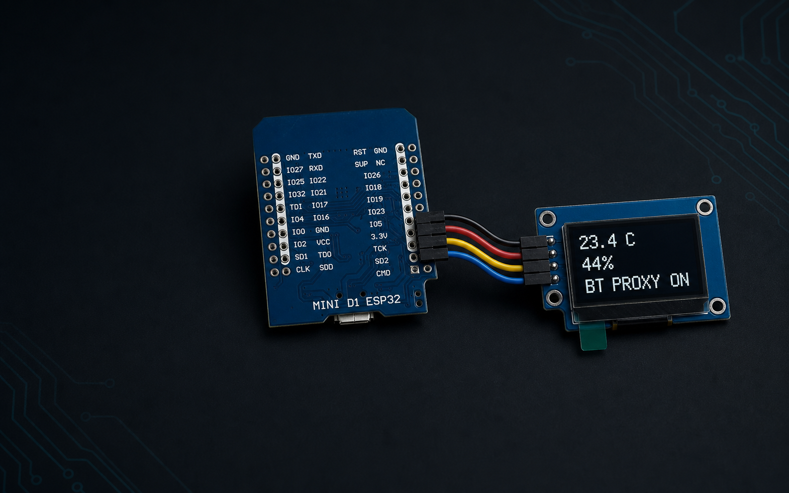

# HA Proxy Panel

HA Proxy Panel turns an ESP32 and a small 128x64 OLED into a useful Home Assistant Bluetooth proxy with a local climate and status display.

[Open the project website](https://wikizell.github.io/ha-proxy-panel/) | [Installation guide](https://wikizell.github.io/ha-proxy-panel/#install) | [Support WikiZell on Ko-fi](https://ko-fi.com/wikizell)



## Features

- Active ESPHome Bluetooth proxy for Home Assistant
- Temperature and humidity from two chosen Home Assistant sensor entities
- Four display modes: Climate, Temperature, Humidity, and Proxy Status
- Screen rotation selectable from Home Assistant without reflashing
- Selection and rotation persist across restarts
- Wi-Fi strength, IP address, uptime, proxy state, and data availability
- CH1115 edge-wrap correction when used in SH1106 compatibility mode
- Safe encrypted Home Assistant API and password-protected OTA updates
- Captive-portal fallback when normal Wi-Fi is unavailable

## Supported hardware

The supplied configuration uses the ESPHome `esp32dev` board profile. It has been tested with the exact parts below.

## Bill of materials

| Qty | Part | Exact identification | Size | Supplier code | Purchase link |
| --- | --- | --- | --- | --- | --- |
| 1 | AZ-Delivery ESP32 D1 Mini NodeMCU, Micro-USB | ESP-WROOM-32, ESP32-D0WDQ6, CP2104, 4 MB flash, Wi-Fi and Bluetooth 4.2 | 39 x 31.5 mm, 12 g | SKU `A 20-2`, GTIN `4260581559441` | [AZ-Delivery ESP32 D1 Mini](https://www.az-delivery.de/en/products/esp32-d1-mini) |
| 1 | ZHONG JING YUAN 1.29 inch PMOLED | White 128x64 display, CH1115 driver, IIC interface, PCB marking `CH1115-128x64DOT`, address `0x3C` | 20 x 45.8 x 2.7 mm | Model `CH1115-128x64DOT` | [Alibaba exact display](https://www.alibaba.com/product-detail/1-29-inch-OLED-display-module_1600894493988.html) |
| 4 | Dupont jumper wires | Female-to-female for boards with fitted headers | About 10 to 20 cm | Any suitable set | Local electronics supplier |
| 1 | USB data cable | Micro-USB data cable for the photographed ESP32; do not use a charge-only cable | Any practical length | Not fixed | Local electronics supplier |
| 1 | USB power supply | Regulated 5 V USB supply, at least 1 A | Not applicable | Not fixed | Local electronics supplier |

The exact display is a ZHONG JING YUAN 1.29 inch PMOLED with a CH1115 driver. Its active area is 14.7 x 29.42 mm, its pixel pitch is 0.23 x 0.23 mm, and it uses a 2.54 mm pitch single-row pin connector. The specified operating temperature is -40 to 85 C. ESPHome drives this CH1115 module using `SH1106 128x64` compatibility mode.

You also need Home Assistant with the ESPHome integration.

## Wiring

Disconnect USB power before wiring. Power the OLED from the ESP32's 3.3 V pin unless the exact module documentation says otherwise.

| OLED | ESP32 | Purpose |
| --- | --- | --- |
| VCC | 3.3V | Display power |
| GND | GND | Ground |
| SDA | GPIO21 | I2C data |
| SCL | GPIO22 | I2C clock |

```text
OLED                         ESP32
VCC  ----------------------  3.3V
GND  ----------------------  GND
SDA  ----------------------  GPIO21
SCL  ----------------------  GPIO22
```

## Quick installation

### 1. Download the project

```bash
git clone https://github.com/WikiZell/ha-proxy-panel.git
cd ha-proxy-panel
```

### 2. Create your secrets file

Copy the example next to the firmware configuration:

```bash
cp firmware/secrets.example.yaml firmware/secrets.yaml
```

On Windows PowerShell:

```powershell
Copy-Item firmware/secrets.example.yaml firmware/secrets.yaml
```

Open `firmware/secrets.yaml` and replace every example value. Generate the API encryption key with:

```bash
openssl rand -base64 32
```

Never commit `firmware/secrets.yaml`. It is already ignored by Git.

### 3. Choose the climate sensors

Open `firmware/ha-proxy-panel.yaml` and change these substitutions to real Home Assistant entity IDs:

```yaml
substitutions:
  temperature_entity: sensor.living_room_temperature
  humidity_entity: sensor.living_room_humidity
```

Find entity IDs in Home Assistant under **Settings > Devices & services > Entities**.

### 4. Flash by USB

Install ESPHome on your computer:

```bash
python -m pip install esphome
```

Connect the ESP32 with a USB data cable, then run:

```bash
esphome run firmware/ha-proxy-panel.yaml
```

Select the detected serial port. Windows ports look like `COM10`; Linux ports commonly look like `/dev/ttyUSB0`.

You can also copy the YAML and secrets into the ESPHome Device Builder add-on, validate the configuration, and choose **Install > Plug into this computer**.

### 5. Add it to Home Assistant

Home Assistant normally discovers the device automatically.

1. Open **Settings > Devices & services**.
2. Select the discovered **ESPHome** device.
3. Enter the API encryption key from `firmware/secrets.yaml` when requested.

If discovery does not appear, choose **Add integration > ESPHome** and enter `ha-proxy-panel.local` or the device IP address.

## Home Assistant controls

The ESPHome device page exposes two dropdowns:

### Display Content

- **Climate** shows temperature and humidity together.
- **Temperature** uses the full center area for temperature.
- **Humidity** uses the full center area for humidity.
- **Proxy Status** shows Wi-Fi strength, IP address, and uptime.

### Display Rotation

- **Normal** uses the normal panel orientation.
- **Rotated 180** flips the OLED for upside-down mounting.

Both selections are stored on the ESP32 and survive restarts.

## Updating over Wi-Fi

After the first USB flash, update over the network:

```bash
esphome run firmware/ha-proxy-panel.yaml --device ha-proxy-panel.local
```

You can also use **Install > Wirelessly** in ESPHome Device Builder.

## Configuration reference

Most installations only need the substitutions at the top of the file.

| Substitution | Default | Description |
| --- | --- | --- |
| `device_name` | `ha-proxy-panel` | Network hostname and ESPHome node name |
| `friendly_name` | `HA Proxy Panel` | Name shown in Home Assistant |
| `display_title` | `HA PROXY PANEL` | OLED header, keep it short |
| `temperature_entity` | example placeholder | Home Assistant temperature entity |
| `humidity_entity` | example placeholder | Home Assistant humidity entity |
| `oled_model` | `SH1106 128x64` | ESPHome display model |
| `oled_address` | `0x3C` | I2C address |
| `oled_sda_pin` | `GPIO21` | I2C SDA pin |
| `oled_scl_pin` | `GPIO22` | I2C SCL pin |

## Troubleshooting

### The display stays black

- Confirm VCC and GND polarity.
- Confirm SDA is GPIO21 and SCL is GPIO22.
- Read ESPHome logs and look for `Found device at address 0x3C`.
- Run an I2C scan. The supplied configuration already enables scanning.
- If your OLED is SSD1306 rather than CH1115 or SH1106, change `oled_model` to the correct ESPHome model.

### Temperature or humidity shows dashes

- Confirm both entity IDs exist in Home Assistant.
- Confirm the entities have numeric states and are not `unknown` or `unavailable`.
- Confirm Home Assistant has an active API connection to the ESPHome device.

### Home Assistant does not discover the proxy

- Confirm the ESP32 and Home Assistant are on networks that allow mDNS and TCP port 6053.
- Add the ESPHome integration manually using the device IP address.
- Check ESPHome logs for Wi-Fi and API connection errors.

### A pixel from the Wi-Fi X appears on the opposite edge

The supplied layout keeps one clear edge pixel and uses controller-native rotation. Keep the CH1115 display in `SH1106 128x64` mode and do not replace the rotation logic with framebuffer rotation.

### Can the physical reset button detect a short and long press?

No. The RESET or EN button resets the ESP32 electrically as soon as it is pressed. Use a separate momentary button on a safe GPIO if you need click and hold actions.

## Project structure

```text
firmware/ha-proxy-panel.yaml     ESPHome firmware
firmware/secrets.example.yaml    Safe configuration template
docs/                            GitHub Pages website
.github/workflows/               Firmware validation and Pages deployment
```

## Contributing

Bug reports and pull requests are welcome. Please read [CONTRIBUTING.md](CONTRIBUTING.md) before submitting a change.

## License and project status

HA Proxy Panel is released under the [MIT License](LICENSE).

This is an independent community project. It is not affiliated with or endorsed by Home Assistant, ESPHome, Nabu Casa, or their maintainers.
